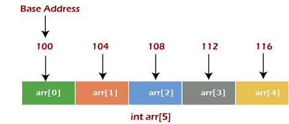

# Introduction
An array is a collection of elements of the same data type placed in contiguous(consecutively)memory location and can be accessed individually using index to a unique given name. An array is a group of related data items that share a common name.
> Note: The most important property of an array is that it's elements are stored in contiguous(next or together in sequence.) memory locations.Eg:int num[5];


# Characteristics of Array
1. All the elements of an array share the same name and they are distinguished from one to another with the help
   of an element or index number.
1. Memory for an array elements is allocated at array declaration time rather than program run time.
1. Once the memory is allocated,it's size cannot be grown or shrunk at the run time.
1. We have to guess the expected size of memory in advance.
1. Array elements are always stored in contiguous memory locations.
1. Any particular element of array can be modified seperately without disturbing other elements.

# Declaration of 1D array
To declare a 1D array in C, specify the data type, the name of the array, and the number of elements:data_type array_name[array_size];
```
int numbers[5];  // Declares an integer array named "numbers" with 5 elements
```

# Initialization of a 1D array
You can initialize an array at the time of declaration by providing values in curly braces { }.
```
int numbers[5] = {1, 2, 3, 4, 5};  // Initializes "numbers" array with 5 values

If you don’t specify the size, the compiler determines it based on the number of elements provided:
int numbers[] = {1, 2, 3, 4, 5};  // Automatically sets size to 5


Alternatively, you can initialize elements individually:
int numbers[5];
numbers[0] = 1;
numbers[1] = 2;
// and so on...
```
# Accessing Elements of a 1D array
Use the index of the element to access or modify it. Array indices start from 0 in C.
```
int value = numbers[2];  // Accesses the third element (index 2) and stores it in "value"
numbers[3] = 10;         // Sets the fourth element (index 3) to 10

```
## Code to demonstrate these steps
```
#include <stdio.h>

int main() {
    // Declaration and Initialization
    int numbers[5] = {1, 2, 3, 4, 5};

    // Accessing elements
    printf("The first element is %d\n", numbers[0]);  // Accessing first element
    numbers[2] = 10;  // Modifying the third element

    // Print all elements
    for (int i = 0; i < 5; i++) {
        printf("numbers[%d] = %d\n", i, numbers[i]);
    }

    return 0;
}
```

# Sorting
Sorting is the process of arranging items in some sequence(ascending or descending) by value or by alphabet or by any other weight.
### Code for sorting elements of 1D array in accending order using selection sort(bubble sort)
```
#include<stdio.h>
int main()
{
    int i,j,temp,n;
    printf("How many number you want to sort: ");
    scanf("%d",&n);
    int nums[n];
    printf("Enter the numbers:\n");
    for(i=0;i<n;i++)
    {
      scanf("%d",&nums[i]);
    }
    printf("The numbers before sorting: \n");
    for(i=0;i<n;i++)
    {
        printf("%d\t",nums[i]);
    }
    for(i=0;i<n-1;i++)
    {
        for(j=i+1;j<n;j++)
        {
            if(nums[i]>nums[j])
            {
                temp=nums[i];
                nums[i]=nums[j];
                nums[j]=temp;
            }
        }
    }
    printf("\nAfter sorting the elements in accending order:\n");
    for(i=0;i<n;i++)
    printf("%d\t",nums[i]);
    return 0;
}
```
# Searching in an array
Searching is the process of finding an element within the list of elements(i.e array).

## Sequential Search
The sequential or linear search is a search technique in which each item of the array is examined in turn and compared with the item being searched for until a match occurs.
### Program to illustrate the searching of an item in an array using sequential search that is searching in unorder array.
```
#include<stdio.h>
#define MAX 5
int main()
{
    int number[MAX],key,i,flag=0;
    for(i=0;i<MAX;i++)
    {
        printf("Enter the %dth element of array: ",i+1);
        scanf("%d",&number[i]);
    }
    printf("Enter the Key element: ");
    scanf("%d",&key);
    for(i=0;i<MAX;i++)
    {
        if(key==number[i])
        {
            flag=1;
            break;
        }
        else
        {
            flag=0;
        }
    }
    if(flag==1)
    {
        printf("%d was found at position %d\n",key,i+1);
    }
    else
    {
        printf("%d was not found",key);
    }
    return 0;
}
```
# Multi-Dimensional Array
The arrays with more then one dimension is called multi dimensional array.Example:
int *a[3][4];*->2 dimensional array with 3-rows and 4-columns.

## Accessing Elements of 2D-Array
The element of ith row and jth column of 2D-array can be accessed with *a[i][j]*.

## Initializing 2D-array
Two dimensional arrays can be initialized rows by rows by seperating the each elements by commas and each rows by {}.example:
```
int *a[4][2]*={{12,56},{13,33},{14,80},{15,78}};
or even this would work with the following
int s[4][2]={12,56,13,33,14,80,15,78};
```
> Note: It is important to remember that while initializing 2-D array,it is necessary to mention the **second(column)**dimension,where as the **first dimension(row)** is optional.


```
int a[2][3]={12,34,23,45,56,45};
int a[][3]={12,34,23,45,56,45};
Above initialization is acceptable

int a[2][]={12,34,23,45,56,45};
int a[][]={12,34,23,45,56,45};
Above initialization is not acceptable;
```
# Short cut method to initialize all the elements of 2d array to Zero.
int marks[3][5]={{0},{0},{0}};

### Code to demonstrate use of 2D array
```
//Program to read M*N martrices and display their sum.
#include<stdio.h>
#define M 3
#define N 3
int main()
{
    int a[M][N],b[M][N],sum[M][N],i,j;
    printf("Enter the elements of Matrix1:\n");
    for(i=0;i<M;i++)
    {
        for(j=0;j<N;j++)
        {
            scanf("%d",&a[i][j]);
        }
    }
    printf("Enter the elements of Matrix2:\n");
    for(i=0;i<M;i++)
    {
        for(j=0;j<N;j++)
        {
            scanf("%d",&b[i][j]);
        }
    }

    //Sum and display
    printf("\nThe sum of the matrices is:\n");
    for(i=0;i<M;i++)
    {
        for(j=0;j<N;j++)
        {
            sum[i][j]=a[i][j]+b[i][j];
            printf("%d\t",sum[i][j]);
        }
        printf("\n");
    }
    return 0;
}
```
# Strings
Strings,are array of characters i.e they are characters arranged one after another in memory.Thus,a character array is called string.A string is always terminated by a null character(i.e slash zero \0).
## Declaring String Variables
A string variable is declared as an array of characters.Syntax:char *string_name[size];*
> Note: When compilier assigns a character string to a character array,it automatically supplies a null character('\0') at the end of the string.Thus,the size should be equal to the maximum number of characters in the string plus one.
## Initializing String Variables
String are initialized in either of the following two forms:
1. char name[4]={'R','A','M','\0'};
1. char name[]={'R','A','M','\0'};
1. char city[9]={'N','E','W',' ','Y','O','R','K','\0'};
1. char name[4]="RAM";
1. char name[]="RAM";
1. char city[9]="NEW YORK";
### String Initialization
```
#include<stdio.h>
int main()
{
    char city[9]={'N','E','W',' ','Y','O','R','K','\0'};
    int i=0;
    while(city[i]!='\0')
    {
        printf("%c\t",city[i]);
        i++;
    }
    return 0;
}
```
## Reading String From Terminal
The input function *scanf()* can be used with %s format specification to read in a string of characters.Eg:char name[20];
```
scanf("%s",name);//No ampersand(&) is required before variable name.
```
Some versions of *scanf()* support the following conversion specifications for strings:
1. %[characters]:means that only the characters specified within the brackets are allowed in the input of string.
1. %[^characters]:means that the characters specified after the caret(^) are not allowed in the string and reading will be terminated.
### Example Code of %[characters].
```
#include<stdio.h>
int main()
{
    char name[20];
    printf("Enter your name (in uppercase): ");
    scanf("%[A-Z]",name);
    printf("Your name is %s",name);
    return 0;
}
```
### Example Code of %[^character]
```
#include<stdio.h>
int main()
{
    char name[30];
    printf("Enter your fullname: ");
    scanf("%[^\n]",name);
    printf("Your fullname is %s",name);
    return 0;
}
```
# String Manipulation using Libary Functions
The <string.h> header file defines some string handling functions such as:
- strcpy()
- strcat()
- strrev()
- strcmp()
- strlen()
## Copying string
The string function such as *strcpy()* is used to copy one string into another string.
### Program to illustrate the use of strcpy() functions
```
#include<stdio.h>
#include<string.h>
int main()
{
    char x[]="Happy New Year!!!";
    char y[50];
    printf("Original String: %s\n",x);
    strcpy(y,x);
    printf("Copied String: %s\n",y);
    return 0;
}
```
## Finding the Length of String
The function *strlen()* returns an integer which denotes the length of the string passed into the function.The length of the string is defined as the number of characters present in the string,excluding null character.Syntax:**interger_variable=strlen(input_string);**
### Program to find the length of a string using libary function strlen().
```
#include<stdio.h>
#include<string.h>
int main()
{
    char str[100];
    int len;
    printf("Enter the string: ");
    gets(str);
    len=strlen(str);
    printf("The lenght of String: %d",len);
    return 0;
}
```
## Concatenating Two String
The string function *strcat()* is used to concatenate two strings.
### Program to concatenate two strings using strcat() libary function.
```
#include<stdio.h>
#include<string.h>
int main()
{
    char s1[20]="Happy ";
    char s2[20]="New Year";
    char s3[50];
    printf("After concatination: %s",strcat(s1,s2));
    return 0;
}
```
## Reversing the string
The function *strrev()* is used to reverse the given string.
### Program to reverse a string using the libary function
```
#include<stdio.h>
#include<string.h>
int main()
{
    char string[100];
    printf("Enter the string: ");
    gets(string);
    strrev(string);
    printf("String After strrev: %s",string);
    return 0;
}
```
## Converting a string to Uppercase
The string function *strupr()* is used to convert the given string into uppercase.
### Program to convert a string to uppercase using libary function
```
#include<stdio.h>
#include<string.h>
int main()
{
    char string[100];
    printf("Enter the string: ");
    gets(string);
    strupr(string);
    printf("String after strupr: %s",string);
    return 0;
}
```
## Converting a string to lowercase
The string function *strlwr()* is used to convert the given string into lowercase.
### Program to convert a string to lowercase using libary function
```
#include<stdio.h>
#include<string.h>
int main()
{
    char string[100];
    printf("Enter the string: ");
    gets(string);
    strlwr(string);
    printf("String after strlwr: %s",string);
    return 0;
}
```
## String Comparison
The function **strcmp(s1,s2)**:compares the string s1 to the sting s2.The function returns 0,less than 0,or greater than 0 if s1 is equal to(identical),less than(alphabetically less then),or alphabetically greater then s2,respectively.
### Program to compare two strings using strcmp() libary functions:
```
#include<stdio.h>
#include<string.h>
int main()
{
    char str1[100];
    char str2[100];
    printf("Enter the String1: ");
    gets(str1);
    printf("Enter the String2: ");
    gets(str2);
    if(strcmp(str1,str2)==0)
    {
        printf("Two strings are Identical,which are String1= %s String2= %s",str1,str2);
    }
    if(strcmp(str1,str2)<0)
    {
        printf("Two strings are not Identical and String1= %s is less then String2= %s",str1,str2); 
    }
    if(strcmp(str1,str2)>0)
    {
        printf("Two strings are not Identical and String1= %s is greater then String2= %s",str1,str2);
    }
    return 0;
}
```
