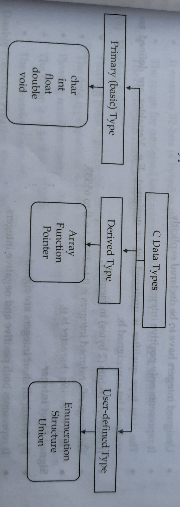
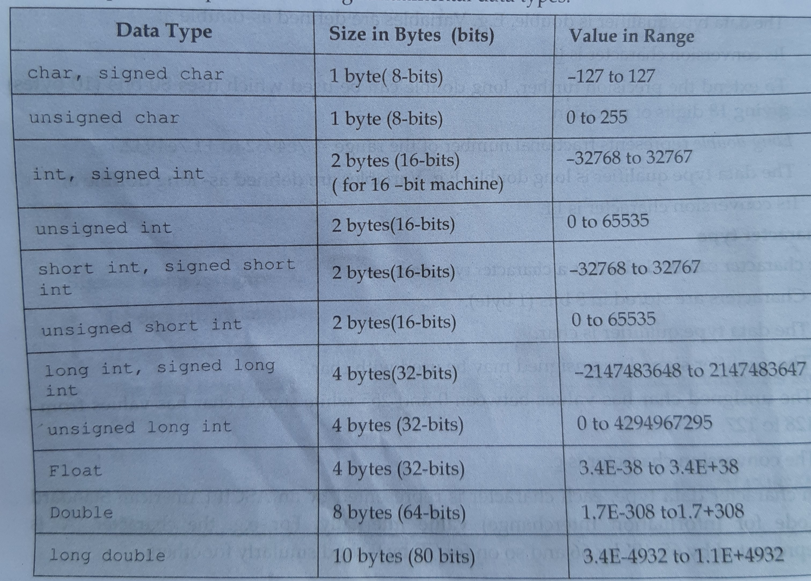

# Introduction of C
C is a powerful, high-level, general-purpose programming language created in 1972 by Dennis Ritchie at Bell Labs. It was initially developed as a system programming language to develop operating systems, specifically for UNIX. Known for its efficiency and performance, C enables low-level access to memory and is highly portable, which makes it ideal for developing operating systems, compilers, and embedded systems.

# History of C programming
1. 1960s: The development of C began as part of efforts to create a better language for system programming. It evolved from languages like B, BCPL, and Assembly.
1. 1972: Dennis Ritchie created C, primarily to improve B and address limitations in previous languages.
1. 1978: Brian Kernighan and Dennis Ritchie published "The C Programming Language," known as K&R C, which became the language's first widely accepted standard.
1. 1989: ANSI (American National Standards Institute) standardized C as ANSI C, also known as C89.
1. 1999: ISO/IEC standardized C as C99, introducing new features like inline functions, new data types, and several library functions.
1. 2011: C11 was released, adding multi-threading support and improving compatibility with other languages.
1. 2018: C18, a minor update, introduced technical corrections to C11.

# Strcuture of C programming
C programs have a structured format, with each program composed of functions and blocks. A typical C program includes:

1. Header Files and Preprocessor Directives:
Header files contain declarations for library functions.
The preprocessor directive #include includes standard libraries (e.g., #include <stdio.h>).
1. main() Function:
Every C program has a main() function, which is the entry point for execution.

1. Variable Declarations and Definitions:
Variables are declared with specific data types such as int, float, char, etc.
Example: int a = 10;
1. Statements and Expressions:
Statements execute actions (like calculations, assignments).
Expressions are calculations or evaluations that yield values.
1. Control Structures:
Conditional Statements: if, else, switch.
Looping Statements: for, while, do...while.
1. Functions:
Functions modularize code, allowing for reusability and ease of debugging.
Example:
```
Copy code
int add(int x, int y) {
    return x + y;
}
```
7. Comments:
Comments in C are added using // for single-line or /* */ for multi-line comments.

# C preprosessor
The C preprocessor is a tool that processes source code before it is compiled by the compiler. It operates on directives, which are commands preceded by a # symbol. These preprocessor directives perform tasks such as file inclusion, macro definitions, conditional compilation, and line control.

# Symbolic Constant
In C, symbolic constants are constant values given a name using the #define preprocessor directive. These constants make code more readable and maintainable by replacing "magic numbers" with descriptive names, which can be updated easily in one place if needed.The syntax for defining a symbolic constant is:#define CONSTANT_NAME value.For eg:#define PI 3.14159.

# C tokens and it's type
In C, tokens are the smallest building blocks of a program, serving as the fundamental units recognized by the compiler. Each C program consists of a series of tokens.
## Types of Tokens in C
There are 6 main types of tokens in C:
1. Keywords
1. Identifiers
1. Constants
1. Strings
1. Operators
1. Special Symbols
- **Keywords**:
Keywords are reserved words in C with a predefined meaning, which cannot be used as identifiers (like variable or function names).
Examples include: int, float, return, if, else, while, for, void, break, etc.
- **Identifiers**:Identifiers are names used to identify variables, functions, arrays, and other user-defined items.
Rules for identifiers:
They must start with a letter (a-z, A-Z) or underscore _.
Subsequent characters can be letters, digits (0-9), or underscores.
Identifiers are case-sensitive (*sum* and *Sum* are different).
Example: *sum, totalAmount, _count*.
-  **Constants:**
   Constants are fixed values that do not change during program execution. C supports several types of constants:
   - Integer constants: Numbers without decimal points (e.g., 10, -20, 0xFF).
   - Floating-point constants: Numbers with decimal points or in exponential notation (e.g., 3.14, 2.5e3).
   - Character constants: Single characters enclosed in single quotes (e.g., 'a', '1').
Example: 100, 3.14159, 'A'
- . **String**:
Strings are sequences of characters enclosed in double quotes.
C treats strings as arrays of characters ending with a null character (\0).
Example: "Hello, World!", "C Programming".
- **Operators**:
 Operators are symbols that perform operations on variables and values.
 Types of operators in C:
    1. Arithmetic operators: +, -, *, /, %
    1. Relational operators: ==, !=, <, >, <=, >=
    1. Logical operators: &&, ||, !
    1. Bitwise operators: &, |, ^, ~, <<, >>
    1. Assignment operators: =, +=, -=, *=, /=, %=
    1. Increment/Decrement operators: ++, --
    1. Example: a + b, x > y, c && d

- . **Special Symbols**:
Special symbols are characters with special functions in C syntax.
   Common examples:
   1. Braces { }: Used to define the start and end of a block of code.
   1. Parentheses ( ): Used in function calls and control structures.
   1. Square brackets [ ]: Used for array indexing.
   1. Comma ,: Separates items in lists (e.g., function parameters).
   1. Semicolon ;: Terminates statements.
   1. Hash #: Used for preprocessor directives (e.g., #include, #define).
   1. Asterisk *: Used in pointer declarations and dereferencing.

# Types of Data types in C


# Data types,Size in Bytes(bits) & value in Range


# Escape Sequences
An Escape sequence is a non-printing character used in C.
```
1.) \a->audible alert or beep sound 
2.) \b->backspace delete on character to the left 
3.) \v->vertical tab
4.) \t->horizontal tab
5.) \'->single quote
6.) \"->double quote
7.) \\backslash 
8.) \0 null character 

```

# Variables
In C, a variable is a named storage location in memory used to hold data that can be modified during program execution. Each variable has a data type, which determines the kind of data it can store (e.g., integer, float, character), and it requires a name (identifier) to reference the stored data.

