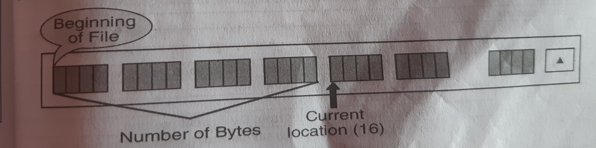
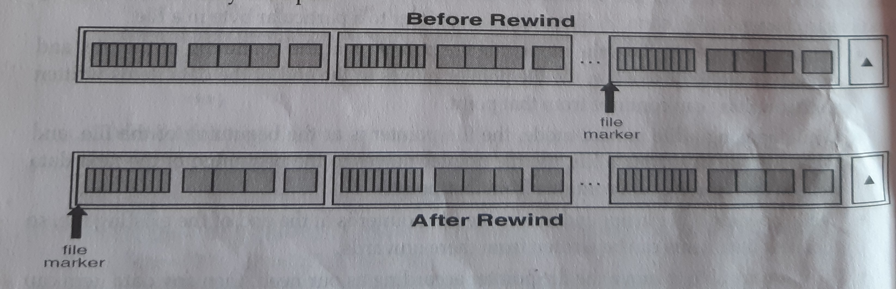
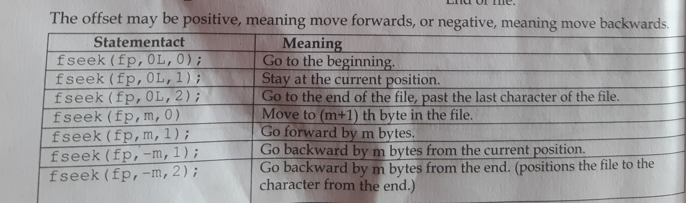

# Introduction

Programs without data files accept input data from the keyboards at the time of execution and write ouput to the monitor is called console I/O.The I/O functions like printf(),scanf(),getchar(),putchar(),puts(),which we used until now are console oriented I/O functions.While using this libary functions following problems arises:
- Entire data is lost when either the program is terminated or the computer is turned off.    
- When the volume of data to be entered is large,it takes a lot of time to enter the data.
- If user makes a mistake while entering data,whole data has to be re-entered.

# Concept of File Handling
Many applications require that information be written to or read from an auxilary memory device.Such information
is stored in memory device in the form of **data files**.A file is a place on the disk(not memory)where a group of related data is stored,also called *data files*.The data files allows us to store information permanently and to access and alter that information whenever necessary.ie.using data files enables us to save our data permanently to disk and retrive them whenever we want.

# Types of data files
- Stream-oriented(or standard)data files:-more easier so commonly used.
- System-oriented(or low-level)data files

## Stream-oriented data files
This can be divided into 2 categories:
1. Text files
1. Unformatted data files

### Text files
The *text files* consists of consecutive characters.These characters can be interpreted as individual data items,or as components of string or numbers.The manner in which these characters are interpreted is determined either by the particular libary functions used to transfer the information,or format specifications within the libary functions.

### Unformatted data files
It organize data into blocks containing contiguous byte of information.These blocks represents more complex data structures,such as arrays and structures.A seperate set of libary function is available for processing these data files.These libary functions provide single instructions to that can transfer entire arrays or structures to or from data files.

## System-oriented data files
They are more closely to the computer's operating system.They are somewhat more complicated to work with though their use may be more effective for certain kinds of applications.A seperate set of procedures,with accompanying
libary functions,is required to process such data files.
There is also another type of file called **binary file**.These files are useful to handle file containing machine language contents,for example .exe or .com files.The files which are stored in binary format differ significantly from data files.

To perform basic file operations,C supports a number of functions,which include functions for:
- naming a file
- opening a file
- reading data from file
- writing data to a file
- closing a file

# Some High level I/O functions
1. fopen():- Create a new file for use,opens an existing file for use 
1. fclose():- Closes a file which was opened for use 
1. fgetc():- reads a character from a file
1. fputc():- writes a character to a file
1. fprintf():- writes a set of data values to a file
1. fscanf():- reads a set of data values from a file
1. fseek():- sets the position to a desired point in the file
1. ftell():- gives the current position in the file(in terms of bytes from the start
1. rewind():- sets the position to the beginning of the file

# Defining and opening a file
A program must open a file before to perform reading and writing operations on the files.Opening a file establishes a link between the program and operating system.This provides the operating system the name of the file and the mode in which the file is to be opened.While working with high level data files,we need buffer area(i.e temporary memory) where information is stored temporarily in the time of transfering data between computer memory and data file.

If we want to store data in a file in the disk,we must specify certain things about the file to the operating system.They are: *Filename,Data structure and Purpose*.Filename is a string of characters that makeup a valid filename for operating system.The filename consists of 2 parts,a primary name and an optional dot with the extension.
**Examples:** *input.data,student.txt,pro.c*,etc
- Data structure of a file is defined as FILE in <stdio.h>.
- So that,all files should be declared as FILE  before they are used.
- FILE is a defined data type.
- The purpose specifies what we want to do with the file.For e.g,we may want to write data to the file or read the already existing file.
- But before a program can write to a file or read from a file,the program must *open* it first.

# Opening and Closing a Data file
When working with stream-oriented data file,the first step is to establish a *buffer area,*where information is temporarily stored while being transferred between computer memory and the data file.*The buffer area* allows information to be read from or written to data file more rapidly than would otherwise be possibble.This buffer area is established by writting:

FILE *ptr_var;
Where FILE(Uppercase letters required) is a special structure type that establish a buffer area,and the ptr_var is a pointer variable that indicates the beginning of the buffer area.The pointer *ptr_var is often reffered as a *stream pointer,file pointer or simply stream*.

# File Opening Modes
1. "r"(read):- This mode opens an existing file for reading only purpose.If the file exists,then file is loaded into the memory and a pointer that points to the first character in the file is assigned to the file pointer.If file doesnot exist,then it returns NULL.The possible operation is-reading from the file only.
**syntax:ptr_var=fopen("Filename","r");**
1. "w"(write):- This mode opens a file for writing only purpose.If the file exists,then the file contents of the file are overwritten(content is deleted first and then written).If the file doesnot exist,a new file is created.It returns NULL,if it is unable to open the file in the write mode.The possible operation is writing to the file only.
**syntax:ptr_var=fopen("filename","w");**
1. "a"(append):- This mode opens an existing file for adding new information at the end of file.If file exists,then the file is loaded into memory and a pointer that points to the last character of the file is assigned to the file pointer.If the file doesnot exist,a new file is created.It returns NULL,if it is unable to open the file in append mode.The possible operation is-adding new contents at the end of file.**syntax:ptr_var=fopen("filename","a");**
1. "r+"(read+write):- This mode opens an existing file for reading and writing purpose.If the file exists,then file is loaded into memory and pointer that points to the first character is the file is assigned to the file pointer.If the file doesnot exist,then it returns NULL.The possible operations are-reading existing contents,writing new contents and modifying existing contents of the file.**syntax:ptr_var=fopen("filename","r+");**
1. "w+"(write+read):- This mode opens a file for reading and writing purpose.If the file exists,then the contents of the file are deleted.If the file doesnot exist,a new file is created.It returns NULL,if it is unable to open the file in this mode.The possible operation are-writing new content,reading them back and modifying the existing contents of the file.**syntax:ptr_var=fopen("filename","w+");**
1. "a+"(append+read):- This mode opens an existing file for reading and appending purpose.If the file exists,then the file is loaded into memory and a pointer that points to the first character in the file is assigned to the file pointer.If the file doesnot exist,then a new file is created.The possible operations are-reading existing contents,appending new contents to the end of the file but it cannot modify existing contents of the file.**syntax:ptr_var=fopen("filename","a+");**

# Closing a file
- A file must be closed as soon as all operations on it have been completed.
- The closing a file ensures that all outstanding information associated with the file is flushed out from buffer and all the links to the file is broken.
- It also prevents any accidental misuse of the file.
- In case where there is a limit to the no.of files that can be kept open simultaneously,closing of unwanted files help in opening the required ones.
- Another instance where we want to close a file is when we want to reopen the same file in different mode.
- The file is closed using libary function *fclose()*as:**fclose(ptr_var);**

# File I/O functions
Once a file is opened,reading out of or writing to it is accomplished using standard I/O functions.

# String I/O functions
Using string I/O functions fgets() and fputs(),data can ne read from a file or written to a file in the form of array of characters:
1. fgets():is used to read string from file.syntax:**fgets(string,int_value,ptr_var);**
> Note: int_value denotes the no.of characters in the string.
1. fputs():is used to write string to a file.syntax:**fputs(string,ptr_var);**
### Code to demonstrate the use of fgets() and fputs()function is below:
```
//Program to create a file name test.txt and write some text "My name is Daenish Arhali"
#include<stdio.h>
#include<stdlib.h>
void main()
{
    FILE *fp;
    fp=fopen("test.txt","w");
    printf("%p\n",fp);
    if(fp==NULL)
    {
        printf("Cannot create a file\n");
        exit(0);
    }
    else
    {
        printf("File is created.");
    }
    fputs("My name is Daenish Arghali",fp);
    fclose(fp);
}
```
```
//Program to open the file name test.txt,read it's content and display it to the screen.
#include<stdio.h>
#include<stdlib.h>
void main()
{
    FILE *fp;
    char s[100];
    fp=fopen("test.txt","r");
    printf("%p\n",fp);
    if(fp==NULL)
    {
        printf("Cannot open file.\n");
        exit(0);
    }
    else
    {
        printf("File opened sucessfully");
    }
    fgets(s,20,fp);
    printf("Text from file is %s",s);
}
```

# Character I/O functions
1. fgetc():used to read a character from a file.syntax:**char_var=fgetc(fp);**
1. fputc():used to write a character to a file.syntax:**fputc('character'or char_var,fp);**
### Code to demonstrate the use of fgetc() and fputc()
```
#include <stdio.h>
#include <stdlib.h>
void main()
{
    FILE *fp;
    char filename[20];
    char c;
    printf("Enter the file name: ");//Type jaan.txt
    scanf("%s", filename);
    getchar();
    fp = fopen(filename, "w");
    if (fp == NULL)
    {
        printf("Cannot create a file.\n");
        exit(0);
    }
    else
    {
        printf("File is created\n");
        printf("Enter your text until enter key:\n");
        while ((c = getchar()) != '\n')
        {
            putc(c, fp);
        }
    }
    fclose(fp);
}
```
```
#include<stdio.h>
#include<stdlib.h>
void main()
{
    FILE *fp;
    char filename[20];
    char c;
    printf("Enter file name: ");
    gets(filename);
    fp=fopen(filename,"r");
    if(fp==NULL)
    {
     printf("Cannot open file\n");
     exit(0);
    }
    else
    {
        printf("The content of the file is :\n");
        while((c=fgetc(fp))!=EOF)
        {
           putchar(c);
        }
    }
    fclose(fp);

}
```
#   End-Of-File(EOF)
-   EOF is a special character(an integer with ASCII value 26)that the end-of-file has been reached.
> Caution: An attempt to read after EOF might cause the program to terminate with an error or result in an infinite loop situation.

# Formatted I/O Functions
- fprintf():-is formatted output function which is used to write int,float,char or string value to a file.syntax:**fprintf(fp,"control_string",list_of_variables);**
- fscanf():-is formatted input function which is used to read int,float,char or string value from a file.syntax:
**fscanf(fp,"control_string",&list_of_variables);**
### Sample code for formatted I/O functions
```
#include<stdio.h>
#include<stdlib.h>
void main()
{
    FILE *fp;
    char name[30];
    char address[30];
    int id;
    float salary;
    printf("Enter name: ");
    gets(name);
    printf("Enter id: ");
    scanf("%d",&id);
    fflush(stdin);
    printf("Enter Addres: ");
    gets(address);
    printf("Enter salary: ");
    scanf("%f",&salary);
    fp=fopen("employee.txt","w");
    if(fp==NULL)
    {
        printf("\nCoulnot open or create file.");
        exit(0);
    }
    printf("Now writing data to the file\n");
    fprintf(fp,"Name=%s\nId=%d\nAddress=%s\nSalary=%.2f",name,id,address,salary);
    printf("Completed Sucessfully");
    fclose(fp);
    
}
```
# Use of fflush()
There is a peculiarity(a strange/unusal feature or behaviour) of scanf() or gets().Here,after providing name of employee,we would hit enter key.....No problem.....and then we provide id of the employee and hit enter key......again...problem.At this time, the enter key which is in the keyboard buffer is read by the gets()/scanf() function for address(as enter key is a character,\n),so that we are able to fill only salary.To avoid this problem,we use the function *fflush()*.It is designed to remove or flush out any data remaining in the buffer.The argument to *fflush()* must be the buffer which we want to flush out.Here,we have used *stdin*,which means buffer realated with standard input device i.e keyboard.

The *fflush()* function writes any buffered data to the specified file stream.When you write data to a file(with a function such as *fprintf()*),it is actually placed in memory buffer.The data is only actually written to the file when buffer is full,the file stream is closed or *fflush()* is called.

# Binary files
A binary file is the one where data is stored on the disk in the same way as it is represented in computer memory.The binary files are not human readable form and they can be created and read only by specific programs written for them.The binary data stored in the file cannot be read using any of the text editors.for e.g:the data 2345 takes 2 bytes of memory.The number of characters written/read is same as the number of characters written/read on the external device.Therefore,there is one-to-one relationship between the characters written/read into the file ans those stored on the external device.

The Binary files organize data into blocks containing contiguous bytes of information.
The binary file,the opening mode of text file is appended by a character b i.e
- "r" is replaced by "rb"
- "w" is replaced by "wb"
- "a" is replaced by "ab"
- "r+" is replaced by "r+b"
- "w+" is replaced by "w+b"
- "a+" is replaced by "a+b"
 1. Syntax to read: fread(buffer, size_of_element, number_of_elements, file_pointer); 
 1. Syntax to read: fwrite(buffer, size_of_element, number_of_elements, file_pointer);

# Reading and writing blocks of data
- Reading and writing blocks of data in C involves  using *fread()* and *fwrite()* functions to handle blocks of memory in one go,rather then working with individual elements.
- This can significantly improve performance,especially dealing with large amounts of data such as array,structures or binary files.
### Writing an entire array of integers to a file in one operation using *fwrite()*
```
#include<stdio.h>
int main()
{
    //Create an array of integers to write
    int numbers[]={10,20,30,40,50};

    //Open the file in binary write mode
    FILE *file=fopen("block_data.bin","wb");
    if(file==NULL)
    {
        printf("Error opening file for writing.\n");
        return 1;
    }
    //Write the entire block(array) to the file in one go
    size_t elementsWritten=fwrite(numbers,sizeof(int),5,file);
    if(elementsWritten!=5)
    {
        printf("Error writing block to file.\n");
    }
    else
    {
        printf("Block of data written Sucessfully.\n");
    }

    //Close the file
    fclose(file);
}
```
### Read back the entire block of integers from the binary file using fread().
```
#include <stdio.h>

int main() {
    // Array to hold the data read from the file
    int numbers[5];

    // Open the file in binary read mode
    FILE *file = fopen("block_data.bin", "rb");
    if (file == NULL) {
        printf("Error opening file for reading.\n");
        return 1;
    }

    // Read the entire block (array) from the file in one go
    size_t elementsRead = fread(numbers, sizeof(int), 5, file);
    if (elementsRead != 5) {
        printf("Error reading block from file.\n");
    } else {
        printf("Block of data read successfully.\n");

        // Print the numbers to verify the read operation
        for (int i = 0; i < 5; i++) {
            printf("Number %d: %d\n", i + 1, numbers[i]);
        }
    }

    // Close the file
    fclose(file);

    return 0;
}
```
# Random access to the file
If we want to access a particular data item placed in any location without starting from the beginning.This is 
called random access or direct access.Random access takes less time than sequential access.For random processing data in disk files,we need to position the file to read the desired data.Second,we can use the positioning functions to change a file's state.A file pointer is a pointer to a particular byte in a file.
so,if we are able to move the file pointer according to our need,then any data item can be read from a file or written onto a file randomly.Thus,we can change the state of the file pointer using one of the positioning functions.C supports these functions for random access file processing.

- fseek()
- ftell()
- rewind()
## The ftell() function
It returns a number of type long,that indicates the current position of file pointer within the file.This function is used to save the curent position of a file,which can be used later in the program.
```
syntax n=ftell(fp);
```
*Here,n would give the relative offset(in bytes) of current position*.This means that n bytes have already been written or read.Here the return type is long int because many files have more than 32,767 bytes.

The above fig illustrates the working of *ftell()*,it returns 16,and the current offset value.
The primary purpose of *ftell()* is to provide data adderess(offset) that can be used in a file seek.It is specially helpful when we are dealing with the text file for which we cannot calculate the position of the data.

## The rewind() function
This function takes a file pointer as argument and resets the current position of the file pointer to the start of the file.Syntax:*rewind(fp);*


## The fseek() function
This function is used to move the file to a desired position within a file.syntax:*feek(fp,offset,position);*
where *fp* is a file pointer,*offset* is a number or variable data type long,position is an interger number.
- The *offset* specifies the number of positions(bytes) to be moved from the location specified by *position*.
- The position can have one of the 3 values.0=beginning of the file,1=current position,2=EOF.

# Example to demonstrate use of fseek()
### Code to write a file of array of integers.
```
#include<stdio.h>
int main()
{
    //Create an array of integers
    int numbers[]={10,20,30,40,50};

    //Open the file for writing in binary mode
    FILE *fp=fopen("random_access.bin","wb");
    if(fp==NULL)
    {
        printf("Error opening file for writing.\n");
        return 1;
    }
    //Write the entire array to the file
    fwrite(numbers,sizeof(int),5,fp);
    fclose(fp);
    printf("Array written to file sucessfully.\n");
    return 0;
}
```
### Code for random access(suppose 3rd element which is 30)
```
//lets read the 3rd element by moving the file pointer directly to its location using fseek()
#include<stdio.h>
#include<stdlib.h>
int main()
{
    //Open the file for reading
    FILE *fp;
    fp=fopen("random_access.bin","rb");
    if(fp==NULL)
    {
        printf("Error opening file for reading.\n");
        return 1;
    }
    //Move the file pointer to the position of the 3rd integer
    //Since each integer is 4 bytes,we move to the 3rd element at offset 2*sizeof(int)
    fseek(fp,2*sizeof(int),SEEK_SET);//SEEK_SET means we are moving from the start of the file

    //read the integer at that position
    int number;
    fread(&number,sizeof(int),1,fp);
    printf("The 3rd number is: %d\n",number);
    fclose(fp);
    return 0;
}
```
### Code to update 3rd element above
```
//If you want to update the 3rd element of the array to a new value(change 30 to 300),you can use fseek()for
//random write.
#include<stdio.h>
int main()
{
    //Open the file for reading and writing in binary mode
    FILE *fp=fopen("random_access.bin","rb+");//allows both reading and writing
    if(fp==NULL)
    {
        printf("Error opening file reading");
        return 1;
    }
    //Move the file pointer to the position of the 3rd element
    fseek(fp,2*sizeof(int),SEEK_SET);
    int new_value=300;
    fwrite(&new_value,sizeof(int),1,fp);
    fclose(fp);
    printf("3rd element Updated Sucessfully.\n");
}

```
# Stream-oriented Vs System-oriented data files
Stream-oriented and System-oriented data files are 2 distinct approches to handle file input/output operations.

1. **Stream-Oriented Data files**
- **Defination**:These files are processed as a contineous flow of data,typically line-by-line or block-by-block,where file is read or written sequentially.
- **Focus**:The focus is on the flow of data(the stream),not on specific records or file system details.
- **Data Structure**:The data is often represented in a linear,unstructured format.
- **Usages**:Common in text processing,such as log files,CSVs,or any files where you process data sequentially.
- **Examples**:Reading and writing text files using a buffer,handling streams with methods like:*fread()* and *fwrite()* in C.
- **Advantages**:
  - Simple and efficent for sequential data processing.
  - Reduces memory usages since only small chunks are processed at a time.  
- **Dis-advantages**:
  - Less efficent for random access operations beacause the file is processed linearly.
  - Not suitable for complex data structures or large records that require indexing.

# Stream-Oriented File example(Reading a txt file line-by-line)
Stream-Oriented I/O uses high level functions like:*fscanf(),fprintf(),fgets()or fputs()* to process data as a stream.
```
#include <stdio.h>

int main() {
    FILE *file;
    char buffer[256];  // Buffer to store each line

    // Open the file in read mode
    file = fopen("data.txt", "r");

    // Check if the file opened successfully
    if (file == NULL) {
        perror("Failed to open file");
        return 1;
    }

    // Read the file line by line
    while (fgets(buffer, sizeof(buffer), file) != NULL) {
        printf("%s", buffer);  // Print each line
    }

    // Close the file
    fclose(file);

    return 0;
}

```

2. System-Oriented Data Files
- **Defination**:These files interact more directly with the file system,and data is accessed based on the system's file management features like *file pointer* and *blocks*.
- **Focus**:Focus is on how the system handles file data,which includes managing file *structures,pointers & system resources*.
- **Data Representation**:Data is more structured,often represented as records or blocks of information,relies on the system's low level I/O operations.
- **Example**:Operations such as *fseek()* and *ftell()* in C/C++ for random access in binary files.
- Advantages:
  - Suitable for random access operations where specific records or blocks need to be retrived.
  - Provide more control over the file I/O operations.
- Disadvantages
  - More complex to implement compared to stream-oriented I/O .
  - Often requires control over the file I/O operations.

Example: System-Oriented File Example (Reading a binary file using low-level operations) System-oriented I/O gives more control over how you read and write data, allowing you to access specific parts of the file. You can use functions like fseek() and ftell() to move the file pointer for random access.

### Example:Reading a binary file using system-oriented approach 
```
#include <stdio.h>
#include <stdlib.h>

int main() {
    FILE *file;
    int buffer;  // Buffer to store integer data

    // Open the file in binary read mode
    file = fopen("data.bin", "rb");

    // Check if the file opened successfully
    if (file == NULL) {
        perror("Failed to open file");
        return 1;
    }

    // Move the file pointer to the 2nd integer (assuming 4 bytes per int)
    fseek(file, sizeof(int), SEEK_SET);

    // Read the 2nd integer from the file
    fread(&buffer, sizeof(int), 1, file);
    printf("2nd integer in file: %d\n", buffer);

    // Move the pointer back to the beginning
    fseek(file, 0, SEEK_SET);

    // Read the 1st integer from the file
    fread(&buffer, sizeof(int), 1, file);
    printf("1st integer in file: %d\n", buffer);

    // Close the file
    fclose(file);

    return 0;
}

```
# Key Differences:
- **Processing Mode**:Stream-oriented files process data sequentially whereas system-oriented files allow for both sequential and random access.
- **Use Cases**:Stream-oriented is better for simple,contineous data,while system-oriented is better for structured data requiring more control and flexibility.
- **Performance**:Stream-oriented is efficient for sequential tasks but less efficient for random access,while system-oriented offers better performance for tasks requiring direct access to specific parts of a file.


