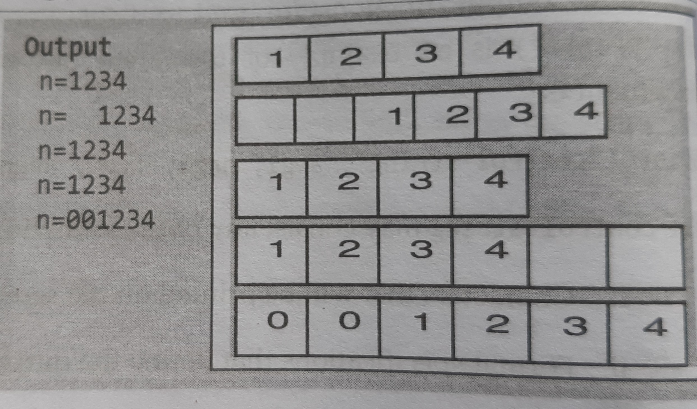
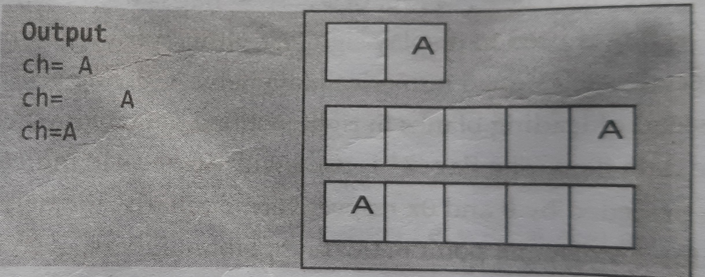
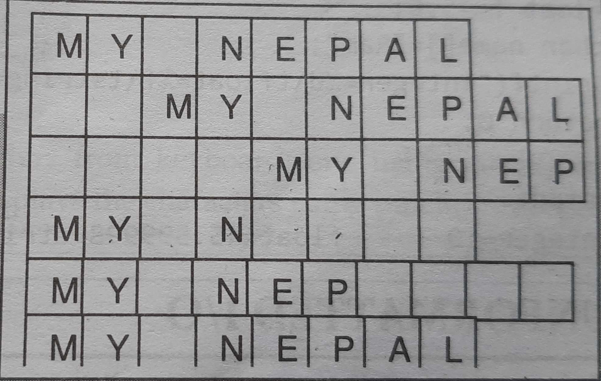
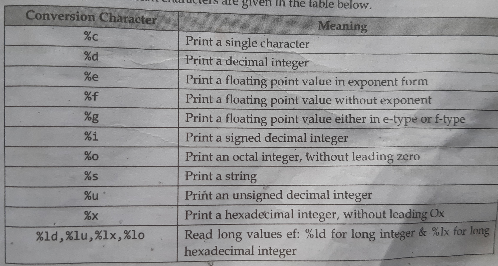

# Formatted InputOutput 
The function which allows input or output data to format according to user's requirement are known as formatted I/O functions.The input function scanf() and output function printf() are formatted I/O functions.for eg.formatted functions can be used to specify the number of digits to be displayed after decimal points,number of spaces before the data item and the position where the output is to be displayed.

# Formatted Input
The build-in function scanf() can be used to input data into the computer from a standard input device.The function can be used to input an nummerical value,single character or string.
### Code for it's use
```
#include <stdio.h>
int main() {
    int a;
    double b;
   char c;
    char str[100];

    printf("Enter an integer: ");
    scanf("%d", &a);
    printf("You entered: %d\n", a);

    printf("Enter a floating-point number: ");
    scanf("%lf", &b);
    printf("You entered: %lf\n", b);

    printf("Enter a character:");
    scanf(" %c", &c); // Note the space before %c to consume any leftover newline
    printf("You entered: %c\n", c);

    printf("Enter a string: ");
    scanf("%s", str); // Reads a string until a whitespace is encountered
    printf("You entered: %s\n", str);

    return 0;
}
```

The scanf() function supports the following conversion specification for strings:
- %[characters]:means that only the characters specified within the bracket are allowed in the input of the string.
- %[^characters]:means the characters,after the caret(^) are not allowed in the string and the reading will be terminatted.
### Code for it's demonstration 
```
//WAP to take input string from the users.Your program should allow the user to input uppercase only.
#include <stdio.h>
int main() {
    char inputString[20];
    // Input for the string
    printf("Enter a string in uppercase only: ");
    scanf("%[A-Z]", inputString); //=> %[character],means that only the characters specified by the breackets are allowed.
    // Output the valid input
    printf("Your input: %s\n", inputString);
    return 0;
}
```
```
//WAP to read a string with a multiple words(i.e. with space) using scanf() function and display on the screen.
#include<stdio.h>
int main()
{
    char string[100];
    printf("Enter your name:");
    scanf("%[^\n]",string);//=> %[^character],the characters specified after the caret(^) are not allowed
    printf("Your name is %s",string);
    return 0;
}
```

# Formatted Output 
Formatted output functions are used to display or store data in a particular specified format.The printf() is an example of formatted output function.The general form of printf() statement is:**printf("control string",arg1,arg2,arg3,.....,argn);**.The arguments arg1,arg2,....,argn are the variables whose values are printed according to the specifications of the control string.The control string has the form:*%[flag][field width][.precision] conversion character*.
- Flags(Optional):The flags may be -,+,0,or #.
  - A '-' flag is used to indicate data item to be left-justified.
  - A '+' flag is used to display sign(either positive or negative whatever data item has) to precede each signed numerical data item.
  - A '0'is used to indicate leading 0s to appear insted of blanks in right justified data item whose mimimum width is larger then the data item.
  - The flag '#' is used with %o or %x to indicate octal or hexadecimal items to be preceded by 0 and 0x repectively.For certain data types, # applies special formatting:
With o (octal), it adds a leading 0.
With x or X (hexadecimal), it adds a leading 0x or 0X.
With f (floating-point), it forces a decimal point to appear even if there are no decimal places.
```
printf("%#o\n", 42);  // Output: 052
printf("%#x\n", 42);  // Output: 0x2a
printf("%#.0f\n", 42.0); // Output: 42.

```

An integer number can be displayed in a desired width with using the format:% **w d**,where **w** is the minimum field width for the output and **d** specifies that the value printed is an integer.The number is displayed right-adjusted in the given field width.Leading blanks will appear as necessary.
### Code for it's demonstration
```
#include<stdio.h>
int main()
{
    int n=1234;
    printf("n= %d\n",n);
    printf("n= %6d\n",n);//Here 6 is the minimum field width
    printf("n= %2d\n",n);
    printf("n= %-6d\n",n);
    printf("n= %06d",n);
    return 0;
}
```

## Output of a Single Character
A single character can be displayed in a desired position using the format:% **w c**.The characters will be displayed right-justified in the field of **w** columns.We can make the display left-adjusted by placing a minus sign before an integer **w**.
### Code for it's demonstration
```
#include<stdio.h>
int main()
{
    char ch='A';
    printf("ch= %2c\n",ch);
    printf("ch= %5c\n",ch);
    printf("Ch= %-5c",ch);
    return 0;
}
```

# Precision[Optional]
The precision is expressed in integers which specifies number of digits to be displayed after decimal point in floating point number.It begins with period(.).
## Output of Real Numbers
The precision is used to limit the number of digits after the decimal point in real numbers.The precision can be further be extended using the field width.The genereal form is,

% w.p f
% w.p e :The integer **w** is the field width(including decimal point) and **p** is the precision.The conversion characters are **f** and **e**.The value is rounded to **p** decimal places and printed right-justified in the field of **w** columns.
### Code to demostrate it 
```
#include<stdio.h>
int main()
{
    char str[10]="My NEPAL";
    printf("%s\n",str);
    printf("%10s\n",str);
    printf("%10.6s\n",str);
    printf("%.4s\n",str);
    printf("%-10.6s\n",str);
    printf("%4s",str);
    return 0;
}
```

# Conversion Character
The conversion character for *printf()* is similar to that of *scanf()*.The conversion character depends upon the type of the variable or constant to be displayed.The commonly used printf() conversion characters are given in the table below.

The following letters may be used as prefix for certain conversion characters;
- h for short integers
- l for long integers or double
- L for long double
### WAP to display an integers,a float and a string value using single printf() function
```
#include<stdio.h>
int main()
{
    int n=10;
    float f=45.6;
    char name[]="Ram";
    printf("Integer= %d\tFloat= %f\tString= %s",n,f,name);
    return 0;
}
```
# Unformatted I/O
Unformatted I/O functions do not allow to read or display in desired format.These type of libary function deals with a single character or string of characters.
- getchar() and putchar():Reads a character from a standard input device.syntax:**character_variable=getchar();**.The *getchar()* function makes wait until a key is pressed and the assigns this character to character_variable.
### Code to demostrate it
```
#include<stdio.h>
int main()
{
    char gender;
    printf("Enter Gender M or F: ");
    gender=getchar();
    printf("Your gender is: ");
    putchar(gender);
    return 0;
}
```
- getch(),getche() and putch():The function *getch()* and *getche()* reads a single character in the instant it is typed without waiting for the enter key to be hit.The difference between them is that *getch()* reads the character typed without echoing it on the screen,while getche() reads the character and echoes(display) it onto screen.
### Code to demonstrate it
```
#include<stdio.h>
int main()
{
    char ch1,ch2;
    printf("Enter 1st character: ");
    ch1=getch();
    printf("Enter 2nd character: ");
    ch2=getche();
    printf("1st character: ");
    putch(ch1);
    printf("\n2nd character: ");
    putch(ch2);
    return 0;
}
```
- gets() and puts():The *gets()* function is used to read a string of text,containing whitespaces,until a new line is encountered.The *puts()* function is used to display the string on the screen.
### Code to demonstrate it
```
#include<stdio.h>
int main()
{
    char name[20];
    printf("Enter name: ");
    gets(name);
    printf("Your name is: ");
    puts(name);
    return 0;
}
```