# Introduction
Pointers in C are variables that store the memory address of another variable.
They are powerful and widely used in C programming for tasks like dynamic memory allocation, array manipulation, and passing variables by reference.

## Key concepts
- **Pointer Declaration**: A pointer is declared using an asterisk * before the variable name.
```
e.g int *p;
This declares a pointer p that can store the address of an integer.
```


- **Adress Operator(&)**:This is used to get the address of a variable.
```
int a = 10;
p = &a;  // p now holds the address of variable a
```

- **Dereference Operator (*)**: This is used to access the value stored at the address held by the pointer.
```
int value = *p;  
// value is now 10, the value at the address stored in p
```
### Simple Example of Pointer
```
#include<stdio.h>
int main()
{
    int a=10;//Declare an integer variable
    int *p=&a;//Declare a pointer to an integer and assign address of a
    printf("Value of a:%d\n",a);//Output the value of a
    printf("Address of a:%p\n",&a);//Output the address of a
    printf("Value of p(address stored in p):%p\n",p);//ouput the address stored in p
    printf("Value pointed by p:%d\n",*p);//Output the value at the address stored in p(which is value of a)

    //Change the value of a using the pointer
    *p=20;
    printf("The new value of a:%d",a);//Output the new Value of a which is 20
    return 0;
}
```

### Why use pointers?
- **Efficiency**:Pointers can improve efficiency by avoiding copying large amount of data.
- **Dynamic Memory**:Pointers are essential for managing dynamic memory(e.g using malloc).
- **Pass by Reference**:Pointers allow functions to modify variables directly.

# NUll pointer
- A NULL pointer is a special pointer value that points nowhere or nothing.
- The predefined constant NULL in stdio.h is used to define the null pointer.
```
#include<stdio.h>
int main()
{
    int *daenish=NULL;//Initialize a pointer to NULL
    if(daenish==NULL)
    {
        printf("Pointer is NULL,it doesnot point to any valid memory.\n");
    }

}
```

# Double pointer 
- A double pointer(or pointer to a pointer)in C is a pointer that holds the address of another pointer,which in turn points
to some data.
- They are often used when you need to change the value of a pointer (e.g., in dynamic memory allocation, 
passing 2D arrays, or modifying pointers in functions).
```
//Double pointer
#include<stdio.h>
int main()
{
    int x=10;
    int *p;
    int **q;
    p=&x;
    printf("Value of x: %d.\n",x);
    printf("Adress of x: %p\n",&x);
    printf("Adress of x ot(value of p)=%p\n",p);
    printf("Address of p: %p\n",&p);
    q=&p;
    printf("Value of x: %d\n",**q);
    printf("Address of x: %p\n",*q);
    printf("Address of p: %p\n",q);
    return 0;
}
```
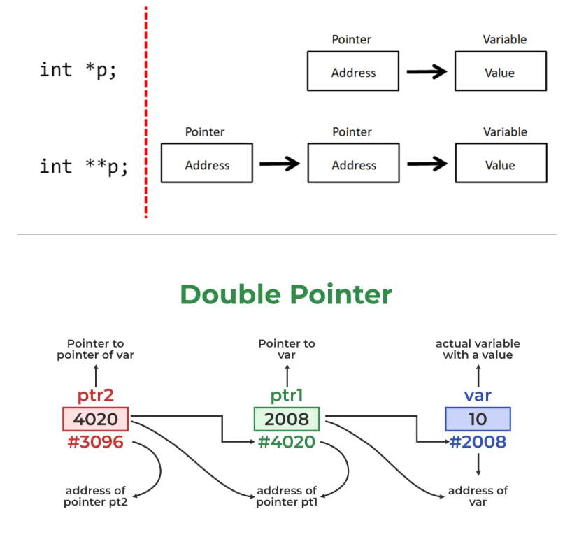
# Array of pointers:
A pointer variable always contains an address of a variable.so,an array of pointers is actually
an array of memory addresses of different variables.
syntax:**data_type *pointer_name[size]**;
## Code to demonstrate array of pointers
```
//Program for illustrating use of array of pointers.
#include<stdio.h>
int main()
{
    int a[5]={1,2,3,4,5};
    int *p[5];
    int i;
    for(i=0;i<5;i++)
    {
        p[i]=&a[i];//holds the address of each elements of an array
        printf("\np[%d]=%d",i+1,*p[i]);
    }
    return 0;
}
//Program to demostrate the use of pointer variables in a program.
#include<stdio.h>
int main()
{
    int a=10,b=20;
    int *pa,*pb;
    pa=&a;
    pb=&b;
    printf("a=%d\nb=%d\npa=%p\npb=%p\n*pa=%d\n*pb=%d\na+b=%d\n*pa+*pb=%d",a,b,pa,pb,*pa,*pb,a+b,*pa+*pb);
    return 0;
}
```
# Passing Pointers to the function
A pointer can be passed to a function as an argument.Passing a pointer means passing address of a variable instead
of value of a variable.
> Note: As address of variable is passed in this mechanism,the passed address is changed within the function,the value of actual variable also changed.
```
#include<stdio.h>
//Function that take a pointer to an int as a argument
void modifyValue(int *p)
{
*p=10;
}
int main()
{
    int a=5;
    printf("Before moddifyValue a=%d\n",a);
    modifyValue(&a);
    printf("After modifyValue a=%d\n",a);
    return 0;
}
```
# Pointers and Array
## 1D array and Pointer
- If a[] is an 1 dimensonal array,then address of 1 array element can be expressed as either &a[0] or simply a.
Similarly address of second array element can be written as &a[1] or(a+1) and so on.=>&a[i] or (a+i).
- Value of 1 array element can be expressed as either a[0] or *a and value of second array can be expressed as
a[1] or *(a+1) and so on.
```
//Program to demonstrate the relationship between arrays and pointer.
#include<stdio.h>
int main()
{
    int a[]={10,20,30,40,50};
    int i,*ptr;
    ptr=&a[0];//hold's the address of a[0]=10
    printf("Arrays and Pointer Equivalent\n");
    // printf("a[i]\t&a[i]\t*ptr\tptr+i\t*(a+i)\ta[i]\ti[a]\n");
    printf("=============================\n");
    for(i=0;i<5;i++)
    {
        printf("a[%d]=%d &a[%d]=%p *[a+%d]=%d [a+%d]=%p\n",i,a[i],i,&a[i],i,*(a+i),i,(a+i));\
    }
    return 0;
}
```
# 2D Array and Pointer
The array name by itself is an address or pointer that points to the first row(first column) element or 00th element) of the 2D array(called base address).Thus if *a* is a 2D array,then address of first row(first column element)can be expressed as either *&a[0][0]* or *a*.
```
In General,
- Address of ith row and jth column
=>&a[i][i]=*(a+i)+j;
- Also the value of ith row and jth column
=>a[i][j]=*(*(a+i)+j);
```
### Code to demostrate it
```
#include<stdio.h>
#define m 2 
#define n 3
int main()
{
    int matrix1[m][n],matrix2[m][n],sum[m][n],i,j;
    printf("Enter the elements of matrix1:\n");
    for(i=0;i<m;i++)
    {
        for(j=0;j<n;j++)
        {
            scanf("%d",*(matrix1+i)+j);
        }
    }
    printf("Enter the elements of matrix2:\n");
    for(i=0;i<m;i++)
    {
        for(j=0;j<n;j++)
        {
            scanf("%d",*(matrix2+i)+j);
        }
    }
    printf("The matrix1:\n");
     for(i=0;i<m;i++)
    {
        for(j=0;j<n;j++)
        {
            printf("%d\t",*(*(matrix1+i)+j));
        }
        printf("\n");
    }

    printf("The matrix2:\n");
     for(i=0;i<m;i++)
    {
        for(j=0;j<n;j++)
        {
            printf("%d\t",*(*(matrix2+i)+j));
        }
        printf("\n");
    }
    printf("The sum is:\n");
    for(i=0;i<m;i++)
    {
        for(j=0;j<n;j++)
        {
            *(*(sum+i)+j)=*(*(matrix1+i)+j)+*(*(matrix2+i)+j);
            printf("%d\t",*(*(sum+i)+j));
        }
        printf("\n");
    }
    return 0;
}
```
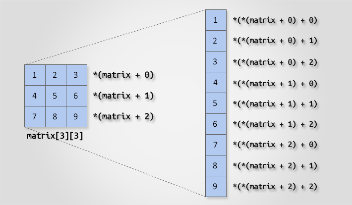
# Pointer Arthematic
Consider the following declarations:
```
int a,b;//ordinary integer variables
float c;//ordinary float variables
int *p1,*p2;//integer pointers
float *f;//float pointer
```
1.) A pointer variable can be assigned the address of an ordinary variable.Eg:p1=&a,f=&c.
2.) The content of one pointer variable can be assigned to another pointer variable provided they point to same data type.Eg:p1=p1,f=p1.
3.) Integer data can be added to or subtracted from pointer variable.eg:p1+1,gives an address which is 2 bytes(1 memory block for integer data) beyond the address pointed by integer pointer p1.
### Code to demonstrate it 
```
#include<stdio.h>
void main()
{
    int *p,x;
    p=&x;
    printf("Enter x: ");
    scanf("%d",p);
    printf("The value of x: %d\n",*p);
    printf("Address of x: %u\n",p);
    printf("p+1=%u\n",p+1);
    printf("p-5=%u\n",p-5);
}
// The value of x: 42
// Address of x: 1000
// p+1 = 1004
// p-5 = 980
// Value of x: Dereferencing p gives 42.
// Address of x: p points to 1000, the address of x.
// Pointer Arithmetic:
// p + 1: Adds 4 (size of int) to 1000, resulting in 1004.
// p - 5: Subtracts 5×4=20 from 1000, resulting in 980.
```
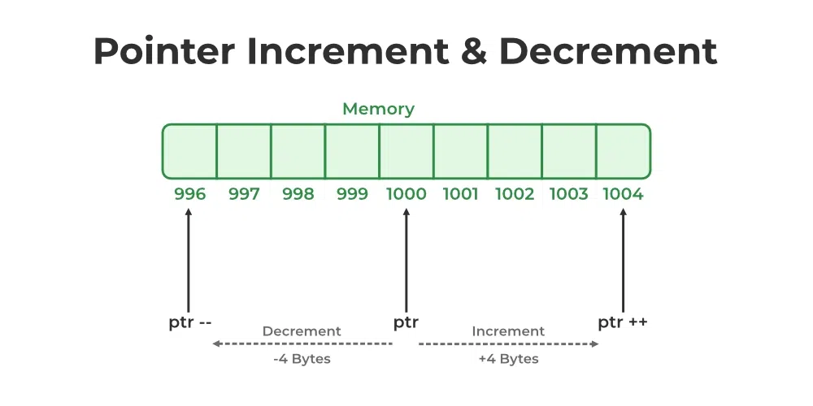
4.) One pointer can be subtracted from another pointer provided they point to elements of same array(or both point to same data type)
```
#include<stdio.h>
void main()
{
    float a[]={1,2,3,4,5};
    float *f1,*f2;
    f1=a;//&a[0];
    f2=a+3;
    printf("%d\n",f2-f1);
    printf("%d\n",f1-f2);
    printf("%f %f\n",*f1,*f2);
}
```
> Note:The difference between the two pointers gives the numeric difference of numbers of memory blocks of it's type to reach the second pointer.The negative sign indicates that the second memory block is to the right of the first pointer.

5.) Two pointer variables can be compared provided both pointers point to objects of the same data type.
```
#include<stdio.h>
#include<conio.h>
int main()
{
    float a=10.5,b=10.5;
    float *f1,*f2;
    f1=&a;
    f2=&b;
    if(f1<f2)
    {
        printf("%u is less then %u",f1,f2);
    }
    if(f1>f2)
    {
        printf("%u is greater then %u",f1,f2);
    }
    if(f1==f2)
    {
        printf("\nImpossible.");
    }
    printf("\n%d",f1-f2);
    return 0;
}
```
6.) An integer value cannot be directly assigned to a pointer.
```
int *p;
p=65100;//wrong
```
7.) Two pointer variables cannot be added or multiplied together(irrespective of their data types).
```
int a,n,*p1,*p2;
p1=&a;
p2=&b;
p1+p2;//invalid
p1*p2;//invalid
```
8.) A pointer variable cannot be multiplied by constant.Eg:p1*2;//invalid
# String and Pointer
As strings are arrays and arrays are closely connected with pointers,we can say that string and pointers are 
closely related.For eg:

char name[5]="Shyam";

As the string variable *name* is an array of characters,it is a pointer to the first character of the string and can be used to access and manipulate the characters of the string.When a pointer to char is printed in the format of string,it will start to print the pointer character and then successively characters until the end of the string is reached.Thus,name prints "Shyam",name+1 prints "hyam",and name+2 prints "yam".
```
//Program to to demostrate the relationship between string and pointer.
#include<stdio.h>
#include<string.h>
int main()
{
    char *namaste="NAMASKAR SIR";
    //char namaste[20]="NAMASKAR SIR";
    char name[40];
    printf("Enter your name: ");
    gets(name);
    puts(namaste);
    printf("Namaskar %s\n",name);
    return 0;
}
```
In the above program,we initiated a string with pointer.Alternatively,the commented line(char namaste[]="NAMASKAR SIR")
is also the same in which the string is initiated using array.Is there a difference?yes .The array version
of this statement reserves a memory of 20 bytes where as pointer only reserves a memory of 13 bytes.
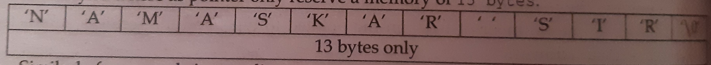
Similary for example in two dimensional array,or initializing an array or pointers to strings.If we initialize set of strings using two dimensional array like:char list [5][10]={"ram","shyam","hari","babu","sitaram"};
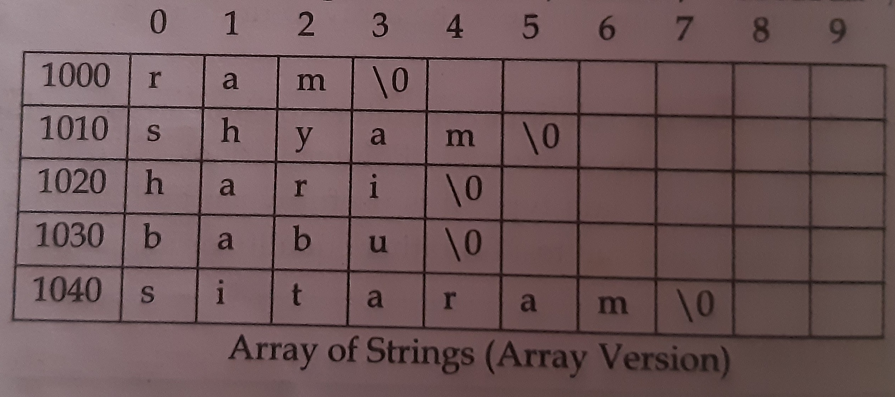

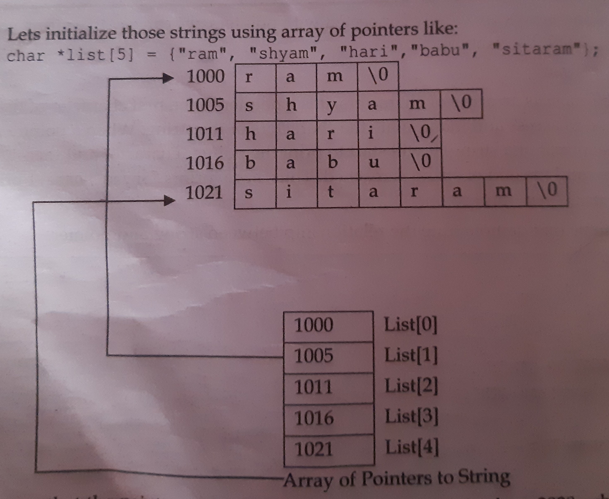
It shows that the pointer version takes up less memory;it ends at 1028,while array version ends at 1049.
# Dynamic Memory Allocation
The process of allocating and freeing memory at run time is known as Dynamic Memory Allocation.This reserves the 
memory required by the program and returns this source to the system once the use of reserved space is utilized.
The process of allocating and freeing memory at the run time(or execution time) is called dynamic memory allocation.
## Problem with Arrays 
- C requires the number of elements in an array to be specified at compile time.
- It is difficult to know the exact size of the array in advance(prior to execution).
- If the size needed at the run time is small then the specified size,then we have wastage of memory space.
- If the size needed at run time is greater then specified size,we will have shortage of memory space.
- Solution DMA.

There are 4 libary functions:**malloc(),calloc(),free() and realloc()** for memory management.This functions are 
defined within header file stdlib.h or alloc.h

### The malloc() function
It allocates requested size of bytes and returns a pointer to the first byte of the allocated space.
syntax:p=(data_type*)malloc(size_of_block);
- Here ,p is a pointer of type data_type.The malloc() returns a pointer to the first byte to an area of memory
with size size_of_block.
- e.g: x=(int*)malloc(100*sizeof(int));

        x=(int*)malloc(400);
- This statement allocates a memory space equivalent to 100 times the size of an interger(100*4B=400b)and the 
address of first byte is assigned to the pointer x of type int. 
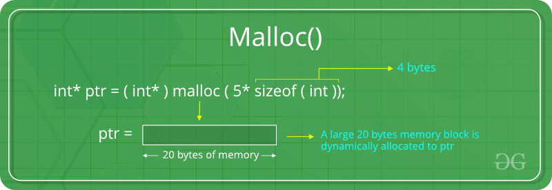  
**Code to demonstrate the use of malloc() and free().**
```
#include<stdio.h>
#include<stdlib.h>//For malloc,free
int main()
{
    int n,i;
    int *arr;

    //Ask the user for the number of elements
    printf("Enter the number of elements: ");
    scanf("%d",&n);

    //Dynamically allocate memory for n intergers
    arr=(int*)malloc(n*sizeof(int));//(int*)forces void pointer to become a interger pointer

    //Check if memory allocation was sucessful
    if(arr==NULL)
    {
        printf("Memory allocation failed!.\n");
        return 1;
    }

    //Input elements into the array
    printf("Enter %d integers:\n",n);
    for(i=0;i<n;i++)
    {
        scanf("%d",&arr[i]);
    }

    //Display the elements
    printf("You entered:\n");
    for(i=0;i<n;i++)
    {
        printf("%d\n",arr[i]);
    }
    
    //Free the dynamically allocated memory
    free(arr);
    return 0;
}
```    
### The free() function
free(void *ptr): Frees the memory previously allocated by malloc, calloc, or realloc.

- “free” method in C is used to dynamically de-allocate the memory.
- The memory allocated using functions malloc() and calloc() is not de-allocated on their own.
- Hence the free() method is used, whenever the dynamic memory allocation takes place.
It helps to reduce wastage of memory by freeing it.
### The calloc() function
- The calloc() function allocates an amount of memory equal to num*size.That is calloc()allocates enough memory for an array of num objects,each object being size byte long.
- syntax:p=(data_type*)calloc(no_of_blocks,size_of_each_block);
- e.g.  x=(int*)calloc(5,100*sizeof(int));
- This statement allocates 5 contiguous blocks of size 400B for each block,i.e we can store 5 array,each of 100 integer elements.
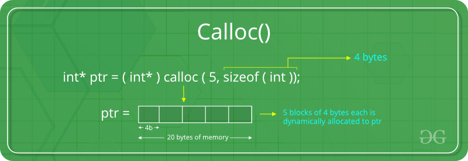
```
//Program to read an array of integers using dynamic memory allocation and display the maximum and minimum value.
#include<stdio.h>
#include<stdlib.h>
void minmax(int *,int);
int main()
{
    int n,i;
    int *num;
    printf("Enter no. of elements in your array: ");
    scanf("%d",&n);
    num=(int*)calloc(n,sizeof(int));
    for(i=0;i<n;i++)
    {
        scanf("%d",num+i);
    }
    minmax(num,n);
    return 0;
}
void minmax(int *no,int n)
{
    int i;
    int min,max;
    min=max=*no;
    for(i=1;i<n;i++)
    {
        if(min>*(no+i))
        {
            min=*(no+i);
        }
        if(max<*(no+i))
        {
            max=*(no+i);
        }
    }
    printf("\nThe maximum number is: %d",max);
    printf("\nThe minimum number is:%d",min);
}
```
### The realloc() function
- This function is used to modify the size of previously allocated space
- syntax:ptr = realloc(ptr, newSize);
- where ptr is reallocated with new size 'newSize'.
> Note:Re-allocation of memory maintains the already present value and new blocks will be initialized with the
 default garbage value.

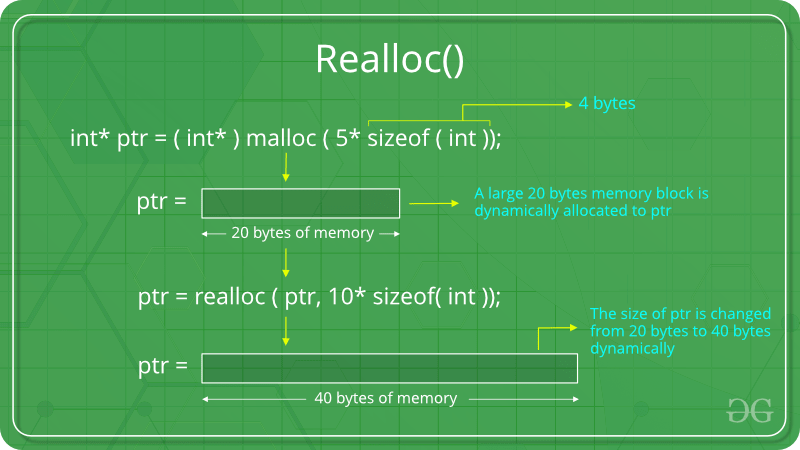
**Code to demonstrate the use of realloc() function.**
```
#include <stdio.h>
#include <stdlib.h>

int main() {
    int *arr;
    int n = 3; // Initial size of the array

    // Allocate memory for an array of 3 integers
    arr = (int*)malloc(n * sizeof(int));

    // Check if memory allocation was successful
    if (arr == NULL) {
        printf("Memory allocation failed.\n");
        return 1; // Exit the program with an error
    }

    // Initialize the array
    printf("Enter %d elements for the array:\n", n);
    for (int i = 0; i < n; i++) {
        scanf("%d", arr + i);
    }

    // Print the original array
    printf("Original array:\n");
    for (int i = 0; i < n; i++) {
        printf("%d\t", *(arr + i));
    }
    printf("\n");

    // Use realloc to resize the array to 5 elements
    n = 5;
    arr = (int*)realloc(arr, n * sizeof(int));

    // Check if realloc() was successful
    if (arr == NULL) {
        printf("Memory allocation failed.\n");
        return 1; // Exit the program with an error
    }

    // Initialize the new elements of the array
    printf("Enter %d additional elements for the resized array:\n", n - 3);
    for (int i = 3; i < n; i++) {
        scanf("%d", arr + i);
    }

    // Print the resized array
    printf("Resized array:\n");
    for (int i = 0; i < n; i++) {
        printf("%d\t", *(arr + i));
    }
    printf("\n");

    // Free the allocated memory
    free(arr);
    return 0;
}
```
### Operations in pointer
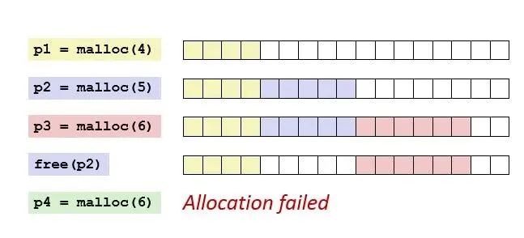
### Malloc vs Calloc
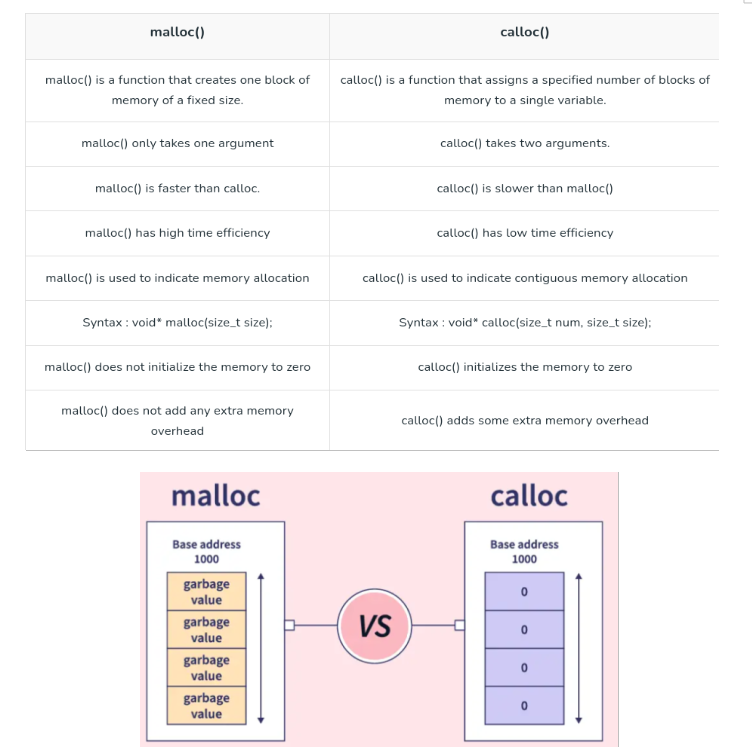


