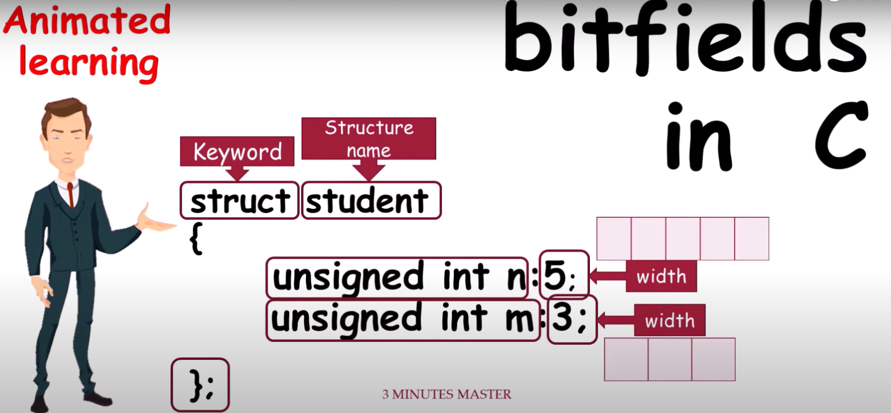
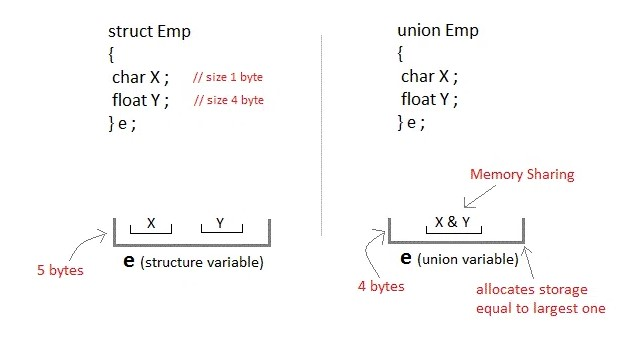
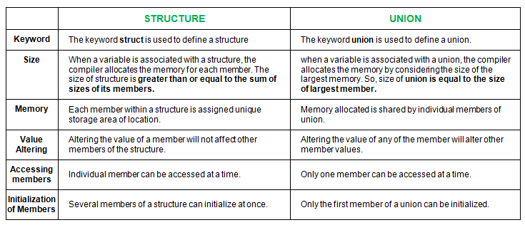

# Structure Introduction
A structure is a collection of variables referenced under one name,providing convenient means of keeping related information together.It is heterogeneous collection of related data elements that share a common name.Structure are one of the ways to create a custom data type in C.It's syntax is:
```
struct structure_name
{
    data_type member-name;
    data_type member-name;
    data_type member-name;
    .
    .
};
```

# Structure variable
A structure variable is a variable of a structure type.
```
struct student
 {
  char name[20];
  int roll_no;
  float marks;
 }
int main()
{
 struct student st;//Thus,student describes the form of a structure(it's type),and st is a variable of the structure
}
```
# Accessing Structure members 
The members of a structure are usally processed individually,as seperate entities.A structure members can be accessed by writting 
```
structure_variable.member_name;
```

# Initializing Structure Variable
*To initialize structure variables,*list the values for the individual members seperated by commas and enclosed in braces.The initial values must appear in the order in which they will be assigned to their correspoding structure members.
```
struct bankaccount
{
    int acc_no;
    char acc_type;
    char name[20];
    float balance;
}myaccount={1001,'C',"Daenish Arghali",100000};
```
# Array of Structures
*Since you can create an array of any valid type,it is possible to define an array of structure*.To declare an array of structure,you must declare a structure and then declare an array variable of that type.
### Code to understand array of structure
```
#include<stdio.h>
struct employee
{
    char name[30];
    char addres[30];
    int age;
    float salary;
};
int main()
{
    struct employee e[10];
    int i,n;
    float average,sum=0;
    printf("How many employee's are there: ");
    scanf("%d",&n);
    for(i=0;i<n;i++)
    {
        printf("\nEnter the Info. of employee%d\n",i+1);
        printf("Enter name: ");
        scanf("%s",e[i].name);
        printf("Enter address: ");
        scanf("%s",e[i].addres);
        printf("Enter age: ");
        scanf("%d",&e[i].age);
        printf("Enter salary: ");
        scanf("%f",&e[i].salary);
        sum=sum+e[i].salary;
    }
    average=sum/n;
    printf("Employee Name\t\tAddess\t\tAge\t\tSalary\n");
    for(i=0;i<n;i++)
    {
        printf("%s\t\t%s\t\t%d\t\t%.2f\n",e[i].name,e[i].addres,e[i].age,e[i].salary);
    }
    printf("\nThe average salary is %.3f",average);
    return 0;
}
```
# Structure Within another structure(nested structure)
If a structure is defined as members of another structure then it is called nested structure.The outer structure is called nesting structure and inner is called nested.
### Program to demonstrate the use of nested structure
```
#include<stdio.h>
struct personal_record
{
    char name[20];
    struct 
    {
        int day_of_birth;
        int month_of_birth;
        int year_of_birth;
    }birthday;
    float salary;
}person;
void main()
{
    printf("Enter the name: ");
    scanf("%s",person.name);
    printf("Enter the day of birthday: ");
    scanf("%d",&person.birthday.day_of_birth);
    printf("Enter the month of birthday: ");
    scanf("%d",&person.birthday.month_of_birth);
    printf("Enter the year of birthday: ");
    scanf("%d",&person.birthday.year_of_birth);
    printf("Enter salary: ");
    scanf("%f",&person.salary);

    printf("Name: %s\n",person.name);
    printf("Birthday: %d/%d/%d\n",person.birthday.day_of_birth,person.birthday.month_of_birth,person.birthday.year_of_birth);
    printf("Salary: %.2f",person.salary);
}
```

# Structure and pointers
We can use pointers with structure variables in the same manner as any other variables.For example,
```
struct account
{
    int acc_no;
    char acc_type;
    char name[10];
    float balance;
};
struct account customer,*pc;
pc=&customer;
```
In this example,customer is a structure variable of type account and pc is a pointer to customer.
An individual structure can be accessed in terms of it's coressponding pointer variable by using ->operator.
For example,
scanf("%d",&pc->acc_no);
> Note: A structure may include one or more pointers as it's members.for e.g:
```
struct account
{
    int *acc_no;
    char acc_type;
    char *name;
    float *balance;
};
```
# Pointer to array of Structure 
We know that the name of the array stands for the address of it's 0th element.This is true for the names of structure variable too.
Let we have a structure as follows:
```
struct book
{
    char name[20];
    int pages;
    float price;
};
struct book b[10],*bptr;
```
Then the assignment statement *bptr=b*;assigns the address of the 0th element of *b* to *bptr*.That is,the pointer *bptr* will now point to *b[0]*.
The members of *b[0]* can be accessed as:
bptr->name   bptr->pages   bptr->price
Similarly member of *b[1]* can be accessed as:
(bptr+1)->name    (bptr+1)->pages     (bptr+1)->price
### Program to demonstrate the use of pointer to struture
```
#include<stdio.h>
struct book
{
    char name[30];
    int pages;
    float price;
};
int main()
{
    struct book b[2],*bptr;
    float temp;
    bptr=b;
    for(bptr=b;bptr<b+2;bptr++)
    {
        //printf("%p\n",bptr);
        printf("Enter name: ");
        scanf("%s",bptr->name);
        printf("Enter pages: ");
        scanf("%d",&bptr->pages);
        printf("Enter price: ");
        scanf("%f",&bptr->price);
    }
    printf("\nName\t\tNo.of pages\tPrice");
    for(bptr=b;bptr<b+2;bptr++)
    {
        printf("\n%s\t\t%d\t\t%.2f\n",bptr->name,bptr->pages,bptr->price);
    }
    return 0;
}
```
# Function and Structure
While passing Structure to the function,we will consider four cases here:
- Passing the individual members to functions
- Passing whole structure to functions
- Passing structure pointer to functions
- Passing array of structure to functions
## 1.)Passing structure members to functions
- Structure memebers can be passed to functions as actual arguments in functions call like ordinary variables.
- Problem:Huge number of structure members
### Let us consider a structure employee having members *name,id,* and *salary* and pass these members to a function:
```
#include<stdio.h>
#include<string.h>
void display(char [],int,float);
int main()
{
    struct employee
    {
        char name[40];
        int id;
        float salary;
    };
    struct employee emp;
    printf("Employee name: \n");
    scanf("%s",emp.name);
    printf("Employee Id: \n");
    scanf("%d",&emp.id);
    printf("Enter Salary of Employee: \n");
    scanf("%f",&emp.salary);
    display(emp.name,emp.id,emp.salary);
    printf("\nName\t\tId\t\tSalary\n");
    printf("%s\t\t%d\t\t%.2f\n",emp.name,emp.id,emp.salary);
    return 0;
}
void display(char e[],int id,float salary)
{
    printf("\nName\t\tId\t\tSalary\n");
    printf("%s\t\t%d\t\t%.2f",e,id,salary);
    strcat(e,"Ramesh");
    id=id+100;
    salary=salary+500;
}
```
## 2.)Passing whole structure to functions
- Whole function can be passed to a function by the syntax:
```
function_name(structure_variable_name);
```
- The called function has the form:
```
return_type function_name(struct tag_name structure_variable_name)
{
  ... ... ...;
}
```
>Note: In this call, only a copy of the structure is passed to the function, so that any changes done to the structure members are not reflected in the original structure.

### Program to demonstrate passing whole structure to function
```
#include<stdio.h>
#include<string.h>
void display(struct employee e);
struct employee
{
    char name[40];
    int id;
    float salary;
};
int main()
{
    struct employee emp;
    printf("Employee name: ");
    scanf("%s",emp.name);
    printf("Employee Id: ");
    scanf("%d",&emp.id);
    printf("Enter salary of Employee: ");
    scanf("%f",&emp.salary);
    display(emp);
    printf("\n\n\nAfter function Call\n");
    printf("\nName\t\t\tId\tSalary\n");
    printf("%s\t\t\t%d\t%.2f",emp.name,emp.id,emp.salary);
    return 0;

}
void display(struct employee e)
{
 printf("\nName\t\tId\t\tSalary\n");
 printf("%s\t\t%d\t\t%.2f",e.name,e.id,e.salary);
 strcat(e.name,"Arghali");
 e.id=e.id+100;
 e.salary=e.salary+1000;
}
```
## 3.)Passsing Structure pointer to the functions
- In this case,address of structure variable is passed as an actual argument to a function.
- The corresponding formal argument must be a structure type pointer variable.
>Note: Any changes made to the members in the called function are directly reflected in the calling functions.

### Program that demonstrate the use of passing structure pointer to function
```
#include<stdio.h>
#include<string.h>
//void display(struct employee *e);
struct employee
{
    char name[40];
    int id;
    float salary;
};
int main()
{
    struct employee emp;
    printf("Employee Name: ");
    scanf("%s",emp.name);
    printf("Employee Id: ");
    scanf("%d",&emp.id);
    printf("Enter salary of Employee: ");
    scanf("%f",&emp.salary);
    display(&emp);
    printf("\n\n\nAfter function call\n");
    printf("\nName\t\t\tId\t\tSalary\n");
    printf(" %s\t\t%d\t\t%.2f",emp.name,emp.id,emp.salary);
    return 0;
}
void display(struct employee *e)
{
    printf("\nName\t\tId\t\tSalary\n");
    printf("%s\t\t%d\t\t%.2f",e->name,e->id,e->salary);
    strcat(e->name,"Arghali");
    e->id=e->id+100;
    e->salary=e->salary+500;
}
```
## 4.)Passing array of structures to functions
- Passing an array of structure type to a function is similar to passing an array of any type to a function.
- That is, the name of the array of structure is passed by calling function which is the base address of the array of structure.
- Thus,any changes made to the array of stucture by called function are directly reflected in the original structure.
> Note:The function prototype comes after the structure defination.

### Programme that demonstrate the use of passing array of structure pointer to function
```
#include<stdio.h>
#include<string.h>
//void display(struct employee ee[]);
struct employee
{
    char name[20];
    int id;
    float salary;
};
int main()
{
    struct employee emp[2];
    float temp;
    int i;
    for(i=0;i<2;i++)
    {
        printf("\nEnter the info about employee%d",i+1);
        printf("\nEmployee name: ");
        scanf("%s",emp[i].name);
        printf("\nEmployee Id: ");
        scanf("%d",&emp[i].id);
        printf("\nEnter salary of employee: ");
        scanf("%f",&temp);
        emp[i].salary=temp;
    }
    display(emp);
    printf("\n\n\nAfter function call\n");
    printf("\nName\t\t\tId\t\tSalary\n");
    for(i=0;i<2;i++)
    {
        printf("%s \t\t%d\t%.2f\n",emp[i].name,emp[i].id,emp[i].salary);
    }
    return 0;
}
void display(struct employee ee[])
{
    int i;
    printf("\n Name\t\tId\t\tSalary\n");
    for(i=0;i<2;i++)
    {
        printf("%s\t\t%d\t\t%.2f\n",ee[i].name,ee[i].id,ee[i].salary);
        strcat(ee[i].name," Arghali");
        ee[i].id=ee[i].id+100;
        ee[i].salary=ee[i].salary+500;
    }
}
```
# Bit Fields in structure 
C facilates the user to store integer members in memory spaces smaller than what the compiler would originally
allow.These space saving structure members are called bit fields.


# Union
Union is heterogeneous collection of data elements related to same entity under the name of same variable.It is 
similar to structure in the sense that they are also used to group together members of different data types.The 
distinction lies in the fact that all the members within a union share the same spaces whereas each members within the structure is allocated a unique memory space.
## Syntax
```
union union_name
{
    data_type member_variable1;
    data_type member_variable2;
    ..........................;
    data_type member_variableN;
}
```
### Program to demonstrate the use of union.
```
#include<stdio.h>
union student
{
    char name[30];
    int roll_no;
    float marks;
};
int main()
{
    union student s;
    printf("Enter name: ");
    gets(s.name);
    puts(s.name);
    printf("Enter Roll_no: ");
    scanf("%d",&s.roll_no);
    printf("Roll no: %d",s.roll_no);
    printf("\nEnter marks: ");
    scanf("%f",&s.marks);
    printf("\nMarks: %.2f",s.marks);
    return 0;
}
```
> Note:The issue with code is that the union only allocates memory for one of its members at a time, so only the value of the last assigned member will be valid. The previous values will be overwritten.

# Structure Vs Union

## Diffeneces between Structure and Union

